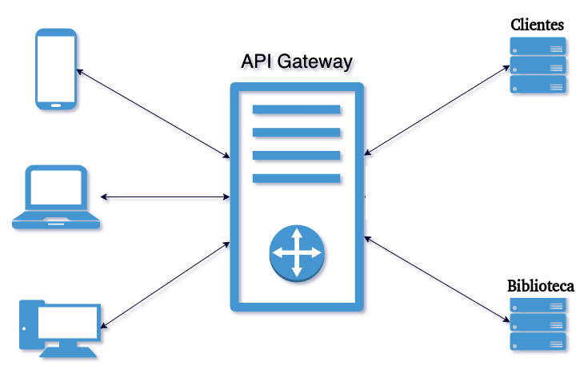

# EXAMEN FINAL 2024

## Library Microservices

Se requiere completar los microservicios para lograr la correcta integracion del siguiente proyecto:

## CONTEXTO
El sistema debe permitir ña gestion de una biblioteca, el cual consta de los siguientes componentes:
* Servicio Clientes: aqui se registran a las personas, esta información luego será consumida por los otros servicios
* Servicio Biblioteca: este servicio cuenta con el registro de los libros y consume el servicio de clientes para realizar la reserva de libros, la devolucion y posterior calculo de los totales a factrar.
* Servicio de API-Gateway: para administrar las peticiones del sistema

## EXAMEN
#### MS-API GATEWAY
* GatewayConfig -> Completar ruteo de microservicios

#### MS-CLIENTES
* PersonaServiceImpl -> completar funcionalidad para retornar un objeto Persona al azar

* Test -> completar los test de la capa de servicio (cobertura superior al 80%)

#### MS-BIBLIOTECA
* LibroServiceImpl -> completar todos los metodos

* BibliotecaServiceImpl  
        >> Completar el metodo de alquiler. Se debe buscar la lista de libros por su codigo de isbn, validar que los libros a alquilar tengan estado DISPONIBLE sino arrojar una exception ya que solo se pueden alquilar libros que esten en dicho estado. Recuperar un cliente desde la api externa /api/personas/aleatorio y guardar la reserva. 
        >> Completar el metodo de devolucion. Se debe buscar la reserva por su id, actualizar la fecha de devolucion y calcular el importe a facturar, actualizar el estado de los libros a DISPONIBLE y guardar el registro con los datos actualizados  
        >> Completar el metodo de calculo. Se calcula el importe a pagar por libro en funcion de la cantidad de dias, es la diferencia entre el alquiler y la devolucion, respetando la siguiente tabla:
  - hasta 2 dias se debe pagar $100 por libro
  - desde 3 dias y hasta 5 dias se debe pagar $150 por libro
  - más de 5 dias se debe pagar $150 por libro + $30 por cada día extra 
        >> Completar el metodo de reporte semanal, se debe retornar la lista de registros de la semana tomando como referencia la fecha de inicio para la busqueda 
        >> Completar el metodo de reporte de libros mas alquilados se debe retornar la lista de libros mas alquilados

* Test -> completar los test de la capa de servicio (cobertura superior al 80%)

#### DOCKER-COMPOSE
* Completar configuracion de los microservicios

